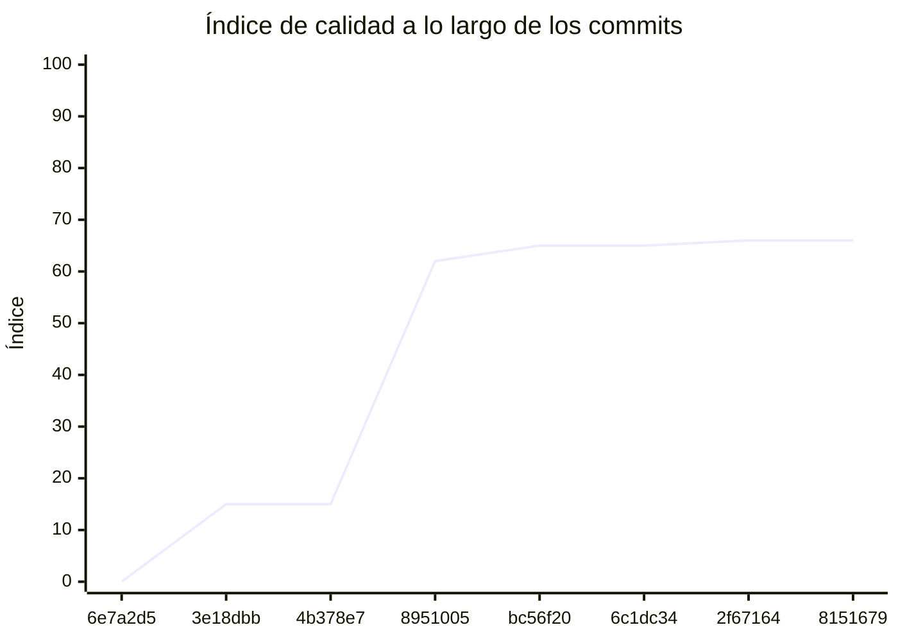

<!-- evaluacion:inicio -->
# Evaluación — Programacion2-IgnacioMilutin-2026/turnos_service

> Documento **generado automáticamente** por la cátedra de Programación II (UM): RepoSense + análisis de calidad de **7 dimensiones**. **No editar a mano**: se regenera en cada evaluación.
> Rama evaluada: `main`. Análisis **heurístico** (regex + métricas) + build: es una criba para orientar la revisión, **no una nota**. La **documentación** del repositorio no se evalúa.
> Generado: 2026-11-18.

## 1. Veredicto

| Aspecto | Resultado |
|---|---|
| Índice de calidad | **77/100** |
| Tipo de repositorio | `backend` |
| Build (`mvnw verify` / `gradlew check`) | OK |
| Código (LOC) | 27,869 |
| Archivos de código | 431 |
| Clases | 553 |
| Código dentro de clases (%POO) | 73% |
| Funciones fuera de clases | 0 |
| Duplicación (puerta) | 4.3% |
| Duplicación lógica | 4.6% |
| Duplicación de boilerplate | 15.4% |
| Cobertura | 98% |
| Tope duro aplicado a D1 | `POO_BAJO` → D1 ≤ 60 |

> Este informe **describe** lo que el análisis midió con los criterios ya establecidos de la materia. No es una nota.

## 2. Semáforo de aprobación

Criterios de la cátedra (`CRITERIOS-CALIDAD.md`): **Aprobar** se juega con el perfil `estandar`; **destacar**, con el `exigente` (meta de excelencia).

| Semáforo | Resultado |
|---|---|
| Aprobar (`estandar`) | **no cumple** — 6/11 |
| Destacar (`exigente`) | **no cumple** — 5/11 |

**Para aprobar, falta cumplir:** SOLID; Duplicación

**Para destacar, falta cumplir:** SOLID; POO; Duplicación

## 3. Autoría (RepoSense)

| Autor | Commits | Código (LOC) | Tests (LOC) | Docs (LOC) | Días activos | % del código |
|---|---:|---:|---:|---:|---:|---:|
| Ignacio Milutin | 108 | 9,252 | 24,063 | 12,049 | 24 | 100% |

> _El LOC de autoría lo calcula RepoSense sobre el historial y puede diferir del LOC de código del análisis (que mira el estado de `main`)._

## 4. Dimensiones evaluadas

Cada dimensión indica **qué mide**, **por qué importa** y **tu resultado**. Cuando el puntaje queda por debajo de la referencia, se agregan preguntas para **investigar la causa** (no hay recetas).

| Dimensión | Peso | Puntaje |
|:--|--:|--:|
| **D1** Diseño OO, SOLID y patrones (20%) | 20% | 1 |
| **D2** Arquitectura hexagonal — backend (15%) | 15% | 100 |
| **D3** Frontend KMP: MVVM y buenas prácticas (10%) | 10% | N/A |
| **D4** Integración y contrato (10%) | 10% | 90 |
| **D5** Seguridad y robustez (10%) | 10% | 100 |
| **D6** Pruebas y cobertura (20%) | 20% | 100 |
| **D7** Proceso y entrega (15%) | 15% | 100 |

### D1. Diseño OO, SOLID y patrones (20%)

- **Qué mide:** Métricas orientadas a objetos (clases, métodos, campos, cohesión, acoplamiento, herencia) y proxies de SOLID, más patrones de diseño.
- **Por qué importa:** El eje de la materia es el buen uso de la POO y su arquitectura: un diseño con clases claras y poco acopladas es más fácil de entender, probar y cambiar.
- **Tu resultado:** **1/100**
- **Para investigar la causa:**
    - ¿Se pensó el modelo de clases antes de codificar o se agrupó después?
    - ¿Qué clases concentran muchas responsabilidades a la vez?
    - ¿Los colaboradores llegan como parámetros o se crean por dentro?

### D2. Arquitectura hexagonal — backend (15%)

- **Qué mide:** Separación en capas (dominio, puertos de entrada/salida, adaptadores) y dirección de las dependencias del backend.
- **Por qué importa:** Aislar el dominio de la infraestructura permite cambiar la base de datos, el framework o el transporte sin tocar las reglas de negocio.
- **Tu resultado:** **100/100**

### D4. Integración y contrato (10%)

- **Qué mide:** Cumplimiento del contrato de integración de la cátedra (formato de errores, paginación, autenticación, endpoints esperados).
- **Por qué importa:** Los servicios deben poder integrarse entre sí y con la app sin sorpresas; el contrato es lo que hacen cumplir las pruebas de integración.
- **Tu resultado:** **90/100**

### D5. Seguridad y robustez (10%)

- **Qué mide:** Credenciales embebidas, consultas SQL por concatenación, y presencia de config de entorno; aislamiento de secretos.
- **Por qué importa:** Un secreto en el repositorio o una consulta construida por concatenación son riesgos concretos, no hipotéticos.
- **Tu resultado:** **100/100**

### D6. Pruebas y cobertura (20%)

- **Qué mide:** Cantidad y resultado de pruebas y cobertura de línea (JaCoCo/Kover, Surefire/Failsafe) cuando hay build.
- **Por qué importa:** Las pruebas son la red de seguridad para refactorizar e integrar; la cobertura acota las zonas sin verificar.
- **Tu resultado:** **100/100**

### D7. Proceso y entrega (15%)

- **Qué mide:** Artefactos verificables de proceso/entrega: `compose`, `.env.example`, CI (`.github/workflows/`), `CODEOWNERS` y wrapper de build (`mvnw`/`gradlew`). **No** puntúa documentación.
- **Por qué importa:** Un proyecto que compila, se levanta y se valida solo es más fácil de revisar y de integrar en equipo.
- **Tu resultado:** **100/100**

## 5. Señales detectadas

El análisis encontró las siguientes señales, con el archivo y la línea donde se originan cuando están disponibles:

**Archivos con más señales**

| Archivo | Señales |
|---|---:|
| `src/main/java/turnos/catedra/infrastructure/client/CatedraHoldClientAdapter.java` | 17 |
| `src/main/java/turnos/reservation/application/usecases/ReconcilePendingProcessesUseCaseImpl.java` | 9 |
| `src/main/java/turnos/catedra/infrastructure/kafka/AppointmentActionReader.java` | 7 |
| `src/main/java/turnos/catedra/domain/model/AppointmentResult.java` | 7 |
| `src/main/java/turnos/reservation/infrastructure/web/controller/ReservationProcessController.java` | 7 |
| `src/main/java/turnos/reservation/domain/model/ReservationProcess.java` | 7 |
| `src/main/java/turnos/reservation/domain/model/ReservationResult.java` | 7 |
| `src/main/java/turnos/catedra/infrastructure/kafka/KafkaAdditionalInformationPublisher.java` | 6 |
| `src/main/java/turnos/catedra/infrastructure/client/CatedraAppointmentClientAdapter.java` | 6 |
| `src/main/java/turnos/reservation/application/usecases/ProcessReservationResultUseCaseImpl.java` | 6 |

**SRP/responsabilidad** (117)
- método 'CatalogAgendaAdapter.getAgenda' con complejidad 6 — `src/main/java/turnos/availability/infrastructure/gateway/CatalogAgendaAdapter.java:26`
- método 'AvailabilityController.getFreeSlots' con complejidad 8 — `src/main/java/turnos/availability/infrastructure/web/controller/AvailabilityController.java:42`
- clase 'CatalogClientAdapter' grande (LOC=107, métodos=11, campos=6) — `src/main/java/turnos/catalog/infrastructure/client/CatalogClientAdapter.java:26`
- clase 'CatalogClientAdapter' con baja cohesión (31%) — `src/main/java/turnos/catalog/infrastructure/client/CatalogClientAdapter.java:26`
- método 'CatalogClientAdapter.requestOnce' con complejidad 8 — `src/main/java/turnos/catalog/infrastructure/client/CatalogClientAdapter.java:68`
- clase 'CatedraOperationRunner' con baja cohesión (7%) — `src/main/java/turnos/catedra/application/support/CatedraOperationRunner.java:23`
- método 'CatedraOperationRunner.run' con complejidad 8 — `src/main/java/turnos/catedra/application/support/CatedraOperationRunner.java:34`
- método 'CancelAppointmentUseCaseImpl.cancelAppointment' con complejidad 7 — `src/main/java/turnos/catedra/application/usecases/CancelAppointmentUseCaseImpl.java:21`
- método 'ConfirmHoldUseCaseImpl.confirmHold' con complejidad 7 — `src/main/java/turnos/catedra/application/usecases/ConfirmHoldUseCaseImpl.java:21`
- método 'CreateHoldUseCaseImpl.createHold' con complejidad 7 — `src/main/java/turnos/catedra/application/usecases/CreateHoldUseCaseImpl.java:26`
- método 'FindAppointmentUseCaseImpl.problem' con complejidad 7 — `src/main/java/turnos/catedra/application/usecases/FindAppointmentUseCaseImpl.java:68`
- método 'GetOccupanciesUseCaseImpl.getOccupancies' con complejidad 7 — `src/main/java/turnos/catedra/application/usecases/GetOccupanciesUseCaseImpl.java:24`
- clase 'RenewTechnicalSessionUseCaseImpl' con baja cohesión (10%) — `src/main/java/turnos/catedra/application/usecases/RenewTechnicalSessionUseCaseImpl.java:23`
- método 'RenewTechnicalSessionUseCaseImpl.attemptLogin' con complejidad 6 — `src/main/java/turnos/catedra/application/usecases/RenewTechnicalSessionUseCaseImpl.java:66`
- clase 'StartTechnicalSessionUseCaseImpl' con baja cohesión (20%) — `src/main/java/turnos/catedra/application/usecases/StartTechnicalSessionUseCaseImpl.java:20`
- método 'StartTechnicalSessionUseCaseImpl.startTechnicalSession' de 30 líneas — `src/main/java/turnos/catedra/application/usecases/StartTechnicalSessionUseCaseImpl.java:30`
- método 'StartTechnicalSessionUseCaseImpl.startTechnicalSession' con complejidad 8 — `src/main/java/turnos/catedra/application/usecases/StartTechnicalSessionUseCaseImpl.java:30`
- método 'Appointment.Appointment' con 10 parámetros — `src/main/java/turnos/catedra/domain/model/Appointment.java:9`
- método 'AppointmentResult.Confirmed' con 8 parámetros — `src/main/java/turnos/catedra/domain/model/AppointmentResult.java:18`
- método 'Confirmed.Confirmed' con 8 parámetros — `src/main/java/turnos/catedra/domain/model/AppointmentResult.java:18`
- método 'AppointmentResult.Rejected' con 5 parámetros — `src/main/java/turnos/catedra/domain/model/AppointmentResult.java:22`
- método 'Rejected.Rejected' con 5 parámetros — `src/main/java/turnos/catedra/domain/model/AppointmentResult.java:22`
- método 'AppointmentResult.Cancelled' con 5 parámetros — `src/main/java/turnos/catedra/domain/model/AppointmentResult.java:35`
- método 'Cancelled.Cancelled' con 5 parámetros — `src/main/java/turnos/catedra/domain/model/AppointmentResult.java:35`
- clase 'HoldConfirmationResult' grande (LOC=33, métodos=12, campos=0) — `src/main/java/turnos/catedra/domain/model/HoldConfirmationResult.java:5`
- método 'TechnicalIntegration.TechnicalIntegration' con 6 parámetros — `src/main/java/turnos/catedra/domain/model/TechnicalIntegration.java:5`
- método 'TechnicalLoginPolicy.TechnicalLoginPolicy' con 5 parámetros — `src/main/java/turnos/catedra/domain/model/TechnicalLoginPolicy.java:6`
- método 'TechnicalSession.TechnicalSession' de 35 líneas — `src/main/java/turnos/catedra/domain/model/TechnicalSession.java:8`
- clase 'CatedraAppointmentClientAdapter' grande (LOC=104, métodos=11, campos=7) — `src/main/java/turnos/catedra/infrastructure/client/CatedraAppointmentClientAdapter.java:28`
- clase 'CatedraAppointmentClientAdapter' con baja cohesión (35%) — `src/main/java/turnos/catedra/infrastructure/client/CatedraAppointmentClientAdapter.java:28`
- método 'CatedraAppointmentClientAdapter.cancelAppointment' con complejidad 8 — `src/main/java/turnos/catedra/infrastructure/client/CatedraAppointmentClientAdapter.java:52`
- método 'CatedraAppointmentClientAdapter.listAppointments' con complejidad 7 — `src/main/java/turnos/catedra/infrastructure/client/CatedraAppointmentClientAdapter.java:83`
- método 'CatedraAppointmentClientAdapter.rejected' con complejidad 7 — `src/main/java/turnos/catedra/infrastructure/client/CatedraAppointmentClientAdapter.java:130`
- clase 'CatedraHoldClientAdapter' grande (LOC=152, métodos=23, campos=6) — `src/main/java/turnos/catedra/infrastructure/client/CatedraHoldClientAdapter.java:35`
- clase 'CatedraHoldClientAdapter' con baja cohesión (9%) — `src/main/java/turnos/catedra/infrastructure/client/CatedraHoldClientAdapter.java:35`
- método 'CatedraHoldClientAdapter.createHold' de 37 líneas — `src/main/java/turnos/catedra/infrastructure/client/CatedraHoldClientAdapter.java:56`
- método 'CatedraHoldClientAdapter.createHold' con 5 parámetros — `src/main/java/turnos/catedra/infrastructure/client/CatedraHoldClientAdapter.java:56`
- método 'CatedraHoldClientAdapter.createHold' con complejidad 9 — `src/main/java/turnos/catedra/infrastructure/client/CatedraHoldClientAdapter.java:56`
- método 'CatedraHoldClientAdapter.post' con complejidad 6 — `src/main/java/turnos/catedra/infrastructure/client/CatedraHoldClientAdapter.java:65`
- método 'CatedraHoldClientAdapter.uri' con complejidad 6 — `src/main/java/turnos/catedra/infrastructure/client/CatedraHoldClientAdapter.java:66`
- método 'CatedraHoldClientAdapter.header' con complejidad 6 — `src/main/java/turnos/catedra/infrastructure/client/CatedraHoldClientAdapter.java:67`
- método 'CatedraHoldClientAdapter.contentType' con complejidad 6 — `src/main/java/turnos/catedra/infrastructure/client/CatedraHoldClientAdapter.java:68`
- método 'CatedraHoldClientAdapter.accept' con complejidad 6 — `src/main/java/turnos/catedra/infrastructure/client/CatedraHoldClientAdapter.java:69`
- método 'CatedraHoldClientAdapter.body' con complejidad 6 — `src/main/java/turnos/catedra/infrastructure/client/CatedraHoldClientAdapter.java:70`
- método 'CatedraHoldClientAdapter.confirmHold' de 34 líneas — `src/main/java/turnos/catedra/infrastructure/client/CatedraHoldClientAdapter.java:95`
- método 'CatedraHoldClientAdapter.confirmHold' con 5 parámetros — `src/main/java/turnos/catedra/infrastructure/client/CatedraHoldClientAdapter.java:95`
- método 'CatedraHoldClientAdapter.confirmHold' con complejidad 7 — `src/main/java/turnos/catedra/infrastructure/client/CatedraHoldClientAdapter.java:95`
- método 'CatedraHoldClientAdapter.confirmationRejection' con complejidad 9 — `src/main/java/turnos/catedra/infrastructure/client/CatedraHoldClientAdapter.java:170`
- clase 'CatedraLoginClientAdapter' con baja cohesión (14%) — `src/main/java/turnos/catedra/infrastructure/client/CatedraLoginClientAdapter.java:29`
- método 'CatedraLoginClientAdapter.login' de 36 líneas — `src/main/java/turnos/catedra/infrastructure/client/CatedraLoginClientAdapter.java:58`
- método 'CatedraLoginClientAdapter.login' con complejidad 9 — `src/main/java/turnos/catedra/infrastructure/client/CatedraLoginClientAdapter.java:58`
- clase 'CatedraOccupancyClientAdapter' con baja cohesión (25%) — `src/main/java/turnos/catedra/infrastructure/client/CatedraOccupancyClientAdapter.java:25`
- método 'CatedraOccupancyClientAdapter.fetchOccupancies' con complejidad 7 — `src/main/java/turnos/catedra/infrastructure/client/CatedraOccupancyClientAdapter.java:47`
- método 'CatedraProperties.CatedraProperties' de 32 líneas — `src/main/java/turnos/catedra/infrastructure/client/CatedraProperties.java:9`
- clase 'AppointmentActionReader' grande (LOC=169, métodos=14, campos=20) — `src/main/java/turnos/catedra/infrastructure/kafka/AppointmentActionReader.java:25`
- clase 'AppointmentActionReader' con baja cohesión (1%) — `src/main/java/turnos/catedra/infrastructure/kafka/AppointmentActionReader.java:25`
- método 'AppointmentActionReader.read' de 39 líneas — `src/main/java/turnos/catedra/infrastructure/kafka/AppointmentActionReader.java:60`
- método 'AppointmentActionReader.read' con complejidad 11 — `src/main/java/turnos/catedra/infrastructure/kafka/AppointmentActionReader.java:60`
- método 'AppointmentActionReader.toAction' con complejidad 7 — `src/main/java/turnos/catedra/infrastructure/kafka/AppointmentActionReader.java:100`
- método 'CatedraKafkaProperties.CatedraKafkaProperties' de 61 líneas — `src/main/java/turnos/catedra/infrastructure/kafka/CatedraKafkaProperties.java:18`
- método 'CatedraKafkaProperties.CatedraKafkaProperties' con complejidad 8 — `src/main/java/turnos/catedra/infrastructure/kafka/CatedraKafkaProperties.java:18`
- clase 'KafkaAdditionalInformationPublisher' grande (LOC=124, métodos=10, campos=6) — `src/main/java/turnos/catedra/infrastructure/kafka/KafkaAdditionalInformationPublisher.java:36`
- clase 'KafkaAdditionalInformationPublisher' con baja cohesión (9%) — `src/main/java/turnos/catedra/infrastructure/kafka/KafkaAdditionalInformationPublisher.java:36`
- método 'KafkaAdditionalInformationPublisher.send' de 34 líneas — `src/main/java/turnos/catedra/infrastructure/kafka/KafkaAdditionalInformationPublisher.java:70`
- método 'KafkaAdditionalInformationPublisher.send' con complejidad 8 — `src/main/java/turnos/catedra/infrastructure/kafka/KafkaAdditionalInformationPublisher.java:70`
- clase 'KafkaConsumerManager' grande (LOC=121, métodos=11, campos=5) — `src/main/java/turnos/catedra/infrastructure/kafka/KafkaConsumerManager.java:31`
- clase 'KafkaConsumerManager' con baja cohesión (22%) — `src/main/java/turnos/catedra/infrastructure/kafka/KafkaConsumerManager.java:31`
- método 'SecurityConfig.securityFilterChain' con 5 parámetros — `src/main/java/turnos/config/SecurityConfig.java:36`
- clase 'ReservationService' grande (LOC=44, métodos=10, campos=10) — `src/main/java/turnos/reservation/application/service/ReservationService.java:28`
- clase 'ReservationService' con baja cohesión (0%) — `src/main/java/turnos/reservation/application/service/ReservationService.java:28`
- método 'ReservationService.createReservationProcess' con 5 parámetros — `src/main/java/turnos/reservation/application/service/ReservationService.java:41`
- clase 'CancelReservationProcessUseCaseImpl' con baja cohesión (14%) — `src/main/java/turnos/reservation/application/usecases/CancelReservationProcessUseCaseImpl.java:27`
- clase 'ConfirmReservationProcessUseCaseImpl' con baja cohesión (47%) — `src/main/java/turnos/reservation/application/usecases/ConfirmReservationProcessUseCaseImpl.java:29`
- clase 'CreateReservationProcessUseCaseImpl' con baja cohesión (27%) — `src/main/java/turnos/reservation/application/usecases/CreateReservationProcessUseCaseImpl.java:36`
- método 'CreateReservationProcessUseCaseImpl.createReservationProcess' con 5 parámetros — `src/main/java/turnos/reservation/application/usecases/CreateReservationProcessUseCaseImpl.java:50`
- método 'CreateReservationProcessUseCaseImpl.holdAndSave' con 5 parámetros — `src/main/java/turnos/reservation/application/usecases/CreateReservationProcessUseCaseImpl.java:59`
- clase 'ExpireOverdueProcessesUseCaseImpl' con baja cohesión (33%) — `src/main/java/turnos/reservation/application/usecases/ExpireOverdueProcessesUseCaseImpl.java:22`
- clase 'ProcessReservationResultUseCaseImpl' grande (LOC=125, métodos=11, campos=5) — `src/main/java/turnos/reservation/application/usecases/ProcessReservationResultUseCaseImpl.java:24`
- clase 'ProcessReservationResultUseCaseImpl' con baja cohesión (7%) — `src/main/java/turnos/reservation/application/usecases/ProcessReservationResultUseCaseImpl.java:24`
- método 'ProcessReservationResultUseCaseImpl.applies' con complejidad 6 — `src/main/java/turnos/reservation/application/usecases/ProcessReservationResultUseCaseImpl.java:74`
- método 'ProcessReservationResultUseCaseImpl.apply' con complejidad 6 — `src/main/java/turnos/reservation/application/usecases/ProcessReservationResultUseCaseImpl.java:84`
- clase 'ReconcilePendingProcessesUseCaseImpl' grande (LOC=150, métodos=10, campos=6) — `src/main/java/turnos/reservation/application/usecases/ReconcilePendingProcessesUseCaseImpl.java:32`
- clase 'ReconcilePendingProcessesUseCaseImpl' con baja cohesión (4%) — `src/main/java/turnos/reservation/application/usecases/ReconcilePendingProcessesUseCaseImpl.java:32`
- método 'ReconcilePendingProcessesUseCaseImpl.reconcilePendingProcesses' de 30 líneas — `src/main/java/turnos/reservation/application/usecases/ReconcilePendingProcessesUseCaseImpl.java:46`
- método 'ReconcilePendingProcessesUseCaseImpl.reconcile' con complejidad 6 — `src/main/java/turnos/reservation/application/usecases/ReconcilePendingProcessesUseCaseImpl.java:89`
- método 'ReconcilePendingProcessesUseCaseImpl.logOutcome' con 5 parámetros — `src/main/java/turnos/reservation/application/usecases/ReconcilePendingProcessesUseCaseImpl.java:156`
- método 'ReconcilePendingProcessesUseCaseImpl.logOutcome' con complejidad 6 — `src/main/java/turnos/reservation/application/usecases/ReconcilePendingProcessesUseCaseImpl.java:156`
- método 'SubmitPhoneUseCaseImpl.submit' con complejidad 6 — `src/main/java/turnos/reservation/application/usecases/SubmitPhoneUseCaseImpl.java:45`
- método 'ReservationListCriteria.ReservationListCriteria' con 7 parámetros — `src/main/java/turnos/reservation/domain/model/ReservationListCriteria.java:10`
- clase 'ReservationProcess' grande (LOC=307, métodos=34, campos=20) — `src/main/java/turnos/reservation/domain/model/ReservationProcess.java:17`
- método 'ReservationProcess.confirmReservation' con 5 parámetros — `src/main/java/turnos/reservation/domain/model/ReservationProcess.java:124`
- método 'ReservationProcess.applyConfirmation' con 5 parámetros — `src/main/java/turnos/reservation/domain/model/ReservationProcess.java:130`
- método 'ReservationProcess.reconcileWith' con complejidad 6 — `src/main/java/turnos/reservation/domain/model/ReservationProcess.java:239`
- método 'ReservationProcess.reconcileClosedWith' con complejidad 6 — `src/main/java/turnos/reservation/domain/model/ReservationProcess.java:283`
- método 'ReservationRecord.ReservationRecord' con 9 parámetros — `src/main/java/turnos/reservation/domain/model/ReservationRecord.java:11`
- método 'ReservationResult.Confirmed' con 8 parámetros — `src/main/java/turnos/reservation/domain/model/ReservationResult.java:18`
- método 'Confirmed.Confirmed' con 8 parámetros — `src/main/java/turnos/reservation/domain/model/ReservationResult.java:18`
- método 'ReservationResult.Rejected' con 5 parámetros — `src/main/java/turnos/reservation/domain/model/ReservationResult.java:22`
- método 'Rejected.Rejected' con 5 parámetros — `src/main/java/turnos/reservation/domain/model/ReservationResult.java:22`
- método 'ReservationResult.Cancelled' con 5 parámetros — `src/main/java/turnos/reservation/domain/model/ReservationResult.java:35`
- método 'Cancelled.Cancelled' con 5 parámetros — `src/main/java/turnos/reservation/domain/model/ReservationResult.java:35`
- método 'CatalogProfessionalAdapter.getProfessional' con complejidad 6 — `src/main/java/turnos/reservation/infrastructure/gateway/CatalogProfessionalAdapter.java:26`
- método 'CatedraAppointmentAdapter.cancel' con complejidad 8 — `src/main/java/turnos/reservation/infrastructure/gateway/CatedraAppointmentAdapter.java:36`
- método 'CatedraAppointmentAdapter.find' con complejidad 6 — `src/main/java/turnos/reservation/infrastructure/gateway/CatedraAppointmentAdapter.java:63`
- método 'CatedraAppointmentAdapter.status' con complejidad 6 — `src/main/java/turnos/reservation/infrastructure/gateway/CatedraAppointmentAdapter.java:79`
- método 'CatedraEventAdapter.toReservationResult' con complejidad 6 — `src/main/java/turnos/reservation/infrastructure/gateway/CatedraEventAdapter.java:55`
- método 'CatedraHoldAdapter.requestHold' con complejidad 9 — `src/main/java/turnos/reservation/infrastructure/gateway/CatedraHoldAdapter.java:39`
- método 'CatedraHoldAdapter.confirmHold' de 44 líneas — `src/main/java/turnos/reservation/infrastructure/gateway/CatedraHoldAdapter.java:64`
- método 'CatedraHoldAdapter.confirmHold' con complejidad 13 — `src/main/java/turnos/reservation/infrastructure/gateway/CatedraHoldAdapter.java:64`
- clase 'JpaReservationProcessRepositoryAdapter' grande (LOC=122, métodos=11, campos=6) — `src/main/java/turnos/reservation/infrastructure/persistence/adapter/JpaReservationProcessRepositoryAdapter.java:30`
- método 'ReservationProcessController.createReservationProcess' de 49 líneas — `src/main/java/turnos/reservation/infrastructure/web/controller/ReservationProcessController.java:68`
- método 'ReservationProcessController.createReservationProcess' con complejidad 14 — `src/main/java/turnos/reservation/infrastructure/web/controller/ReservationProcessController.java:68`
- método 'ReservationProcessController.confirmReservationProcess' de 36 líneas — `src/main/java/turnos/reservation/infrastructure/web/controller/ReservationProcessController.java:121`
- método 'ReservationProcessController.confirmReservationProcess' con complejidad 13 — `src/main/java/turnos/reservation/infrastructure/web/controller/ReservationProcessController.java:121`
- método 'ReservationProcessController.submitPhone' con complejidad 9 — `src/main/java/turnos/reservation/infrastructure/web/controller/ReservationProcessController.java:160`
- método 'ReservationProcessController.cancelReservationProcess' con complejidad 8 — `src/main/java/turnos/reservation/infrastructure/web/controller/ReservationProcessController.java:221`
- clase 'ReservationProcessDtoMapper' con baja cohesión (0%) — `src/main/java/turnos/reservation/infrastructure/web/mapper/ReservationProcessDtoMapper.java:18`

**DIP/concretos** (85)
- clase 'GetFreeSlotsUseCaseImpl' muy acoplada (CBO=19) — `src/main/java/turnos/availability/application/usecases/GetFreeSlotsUseCaseImpl.java:29`
- clase 'GetFreeSlotsUseCaseImpl' instancia 3 concretos (CBO=19) — `src/main/java/turnos/availability/application/usecases/GetFreeSlotsUseCaseImpl.java:29`
- clase 'ProfessionalAgenda' muy acoplada (CBO=12) — `src/main/java/turnos/availability/domain/model/ProfessionalAgenda.java:23`
- clase 'CatalogAgendaAdapter' muy acoplada (CBO=16) — `src/main/java/turnos/availability/infrastructure/gateway/CatalogAgendaAdapter.java:21`
- clase 'CatalogAgendaAdapter' instancia 4 concretos (CBO=16) — `src/main/java/turnos/availability/infrastructure/gateway/CatalogAgendaAdapter.java:21`
- clase 'CatedraOccupancyAdapter' muy acoplada (CBO=14) — `src/main/java/turnos/availability/infrastructure/gateway/CatedraOccupancyAdapter.java:24`
- clase 'CatedraOccupancyAdapter' instancia 3 concretos (CBO=14) — `src/main/java/turnos/availability/infrastructure/gateway/CatedraOccupancyAdapter.java:24`
- clase 'AvailabilityController' muy acoplada (CBO=35) — `src/main/java/turnos/availability/infrastructure/web/controller/AvailabilityController.java:35`
- clase 'AvailabilityDtoMapper' muy acoplada (CBO=11) — `src/main/java/turnos/availability/infrastructure/web/mapper/AvailabilityDtoMapper.java:13`
- clase 'CatalogClientAdapter' muy acoplada (CBO=33) — `src/main/java/turnos/catalog/infrastructure/client/CatalogClientAdapter.java:26`
- clase 'CatedraOperationRunner' muy acoplada (CBO=29) — `src/main/java/turnos/catedra/application/support/CatedraOperationRunner.java:23`
- clase 'CancelAppointmentUseCaseImpl' muy acoplada (CBO=15) — `src/main/java/turnos/catedra/application/usecases/CancelAppointmentUseCaseImpl.java:13`
- clase 'CheckTechnicalIntegrationUseCaseImpl' muy acoplada (CBO=9) — `src/main/java/turnos/catedra/application/usecases/CheckTechnicalIntegrationUseCaseImpl.java:15`
- clase 'ConfirmHoldUseCaseImpl' muy acoplada (CBO=15) — `src/main/java/turnos/catedra/application/usecases/ConfirmHoldUseCaseImpl.java:13`
- clase 'CreateHoldUseCaseImpl' muy acoplada (CBO=18) — `src/main/java/turnos/catedra/application/usecases/CreateHoldUseCaseImpl.java:18`
- clase 'FindAppointmentUseCaseImpl' muy acoplada (CBO=26) — `src/main/java/turnos/catedra/application/usecases/FindAppointmentUseCaseImpl.java:18`
- clase 'GetOccupanciesUseCaseImpl' muy acoplada (CBO=17) — `src/main/java/turnos/catedra/application/usecases/GetOccupanciesUseCaseImpl.java:17`
- clase 'ReceiveAdditionalInformationRequestUseCaseImpl' muy acoplada (CBO=8) — `src/main/java/turnos/catedra/application/usecases/ReceiveAdditionalInformationRequestUseCaseImpl.java:13`
- clase 'ReceiveAppointmentResultUseCaseImpl' muy acoplada (CBO=8) — `src/main/java/turnos/catedra/application/usecases/ReceiveAppointmentResultUseCaseImpl.java:13`
- clase 'RenewTechnicalSessionUseCaseImpl' muy acoplada (CBO=22) — `src/main/java/turnos/catedra/application/usecases/RenewTechnicalSessionUseCaseImpl.java:23`
- clase 'StartTechnicalSessionUseCaseImpl' muy acoplada (CBO=21) — `src/main/java/turnos/catedra/application/usecases/StartTechnicalSessionUseCaseImpl.java:20`
- clase 'SubmitAdditionalInformationUseCaseImpl' muy acoplada (CBO=14) — `src/main/java/turnos/catedra/application/usecases/SubmitAdditionalInformationUseCaseImpl.java:18`
- clase 'TechnicalSession' muy acoplada (CBO=12) — `src/main/java/turnos/catedra/domain/model/TechnicalSession.java:8`
- clase 'TechnicalSession' instancia 4 concretos (CBO=12) — `src/main/java/turnos/catedra/domain/model/TechnicalSession.java:8`
- clase 'CatedraAppointmentClientAdapter' muy acoplada (CBO=45) — `src/main/java/turnos/catedra/infrastructure/client/CatedraAppointmentClientAdapter.java:28`
- clase 'CatedraHoldClientAdapter' muy acoplada (CBO=68) — `src/main/java/turnos/catedra/infrastructure/client/CatedraHoldClientAdapter.java:35`
- clase 'CatedraLoginClientAdapter' muy acoplada (CBO=29) — `src/main/java/turnos/catedra/infrastructure/client/CatedraLoginClientAdapter.java:29`
- clase 'CatedraOccupancyClientAdapter' muy acoplada (CBO=33) — `src/main/java/turnos/catedra/infrastructure/client/CatedraOccupancyClientAdapter.java:25`
- clase 'AppointmentActionListener' muy acoplada (CBO=8) — `src/main/java/turnos/catedra/infrastructure/kafka/AppointmentActionListener.java:14`
- clase 'AppointmentActionReader' muy acoplada (CBO=34) — `src/main/java/turnos/catedra/infrastructure/kafka/AppointmentActionReader.java:25`
- clase 'AppointmentActionReader' instancia 13 concretos (CBO=34) — `src/main/java/turnos/catedra/infrastructure/kafka/AppointmentActionReader.java:25`
- clase 'CatedraKafkaProperties' muy acoplada (CBO=19) — `src/main/java/turnos/catedra/infrastructure/kafka/CatedraKafkaProperties.java:18`
- clase 'KafkaAdditionalInformationPublisher' muy acoplada (CBO=46) — `src/main/java/turnos/catedra/infrastructure/kafka/KafkaAdditionalInformationPublisher.java:36`
- clase 'KafkaConsumerManager' muy acoplada (CBO=39) — `src/main/java/turnos/catedra/infrastructure/kafka/KafkaConsumerManager.java:31`
- clase 'KafkaConsumerManager' instancia 4 concretos (CBO=39) — `src/main/java/turnos/catedra/infrastructure/kafka/KafkaConsumerManager.java:31`
- clase 'ApiExceptionHandler' muy acoplada (CBO=32) — `src/main/java/turnos/config/ApiExceptionHandler.java:30`
- clase 'SecurityConfig' muy acoplada (CBO=30) — `src/main/java/turnos/config/SecurityConfig.java:29`
- clase 'SecurityConfig' instancia 4 concretos (CBO=30) — `src/main/java/turnos/config/SecurityConfig.java:29`
- clase 'SecurityProblemHandler' muy acoplada (CBO=20) — `src/main/java/turnos/config/SecurityProblemHandler.java:25`
- clase 'ReservationService' muy acoplada (CBO=19) — `src/main/java/turnos/reservation/application/service/ReservationService.java:28`
- clase 'CancelReservationProcessUseCaseImpl' muy acoplada (CBO=29) — `src/main/java/turnos/reservation/application/usecases/CancelReservationProcessUseCaseImpl.java:27`
- clase 'CancelReservationProcessUseCaseImpl' instancia 5 concretos (CBO=29) — `src/main/java/turnos/reservation/application/usecases/CancelReservationProcessUseCaseImpl.java:27`
- clase 'ConfirmReservationProcessUseCaseImpl' muy acoplada (CBO=29) — `src/main/java/turnos/reservation/application/usecases/ConfirmReservationProcessUseCaseImpl.java:29`
- clase 'ConfirmReservationProcessUseCaseImpl' instancia 7 concretos (CBO=29) — `src/main/java/turnos/reservation/application/usecases/ConfirmReservationProcessUseCaseImpl.java:29`
- clase 'CreateReservationProcessUseCaseImpl' muy acoplada (CBO=34) — `src/main/java/turnos/reservation/application/usecases/CreateReservationProcessUseCaseImpl.java:36`
- clase 'CreateReservationProcessUseCaseImpl' instancia 8 concretos (CBO=34) — `src/main/java/turnos/reservation/application/usecases/CreateReservationProcessUseCaseImpl.java:36`
- clase 'ExpireOverdueProcessesUseCaseImpl' muy acoplada (CBO=19) — `src/main/java/turnos/reservation/application/usecases/ExpireOverdueProcessesUseCaseImpl.java:22`
- clase 'FindReservationProcessesByUserUseCaseImpl' muy acoplada (CBO=11) — `src/main/java/turnos/reservation/application/usecases/FindReservationProcessesByUserUseCaseImpl.java:18`
- clase 'GetReservationProcessByIdUseCaseImpl' muy acoplada (CBO=14) — `src/main/java/turnos/reservation/application/usecases/GetReservationProcessByIdUseCaseImpl.java:19`
- clase 'ProcessPhoneRequestUseCaseImpl' muy acoplada (CBO=21) — `src/main/java/turnos/reservation/application/usecases/ProcessPhoneRequestUseCaseImpl.java:22`
- clase 'ProcessReservationResultUseCaseImpl' muy acoplada (CBO=30) — `src/main/java/turnos/reservation/application/usecases/ProcessReservationResultUseCaseImpl.java:24`
- clase 'ReconcilePendingProcessesUseCaseImpl' muy acoplada (CBO=40) — `src/main/java/turnos/reservation/application/usecases/ReconcilePendingProcessesUseCaseImpl.java:32`
- clase 'Result' muy acoplada (CBO=8) — `src/main/java/turnos/reservation/application/usecases/ReconcilePendingProcessesUseCaseImpl.java:180`
- clase 'SubmitPhoneUseCaseImpl' muy acoplada (CBO=26) — `src/main/java/turnos/reservation/application/usecases/SubmitPhoneUseCaseImpl.java:27`
- clase 'SubmitPhoneUseCaseImpl' instancia 8 concretos (CBO=26) — `src/main/java/turnos/reservation/application/usecases/SubmitPhoneUseCaseImpl.java:27`
- clase 'ReservationEventOutcome' muy acoplada (CBO=8) — `src/main/java/turnos/reservation/domain/model/ReservationEventOutcome.java:4`
- clase 'ReservationProcess' muy acoplada (CBO=42) — `src/main/java/turnos/reservation/domain/model/ReservationProcess.java:17`
- clase 'ReservationProcess' instancia 10 concretos (CBO=42) — `src/main/java/turnos/reservation/domain/model/ReservationProcess.java:17`
- clase 'ReservationStatus' muy acoplada (CBO=8) — `src/main/java/turnos/reservation/domain/model/ReservationStatus.java:3`
- clase 'ReservationProcessRepository' muy acoplada (CBO=9) — `src/main/java/turnos/reservation/domain/ports/out/ReservationProcessRepository.java:11`
- clase 'CatalogProfessionalAdapter' muy acoplada (CBO=16) — `src/main/java/turnos/reservation/infrastructure/gateway/CatalogProfessionalAdapter.java:21`
- clase 'CatalogProfessionalAdapter' instancia 4 concretos (CBO=16) — `src/main/java/turnos/reservation/infrastructure/gateway/CatalogProfessionalAdapter.java:21`
- clase 'CatedraAppointmentAdapter' muy acoplada (CBO=31) — `src/main/java/turnos/reservation/infrastructure/gateway/CatedraAppointmentAdapter.java:30`
- clase 'CatedraAppointmentAdapter' instancia 11 concretos (CBO=31) — `src/main/java/turnos/reservation/infrastructure/gateway/CatedraAppointmentAdapter.java:30`
- clase 'CatedraEventAdapter' muy acoplada (CBO=19) — `src/main/java/turnos/reservation/infrastructure/gateway/CatedraEventAdapter.java:23`
- clase 'CatedraHoldAdapter' muy acoplada (CBO=37) — `src/main/java/turnos/reservation/infrastructure/gateway/CatedraHoldAdapter.java:33`
- clase 'CatedraHoldAdapter' instancia 17 concretos (CBO=37) — `src/main/java/turnos/reservation/infrastructure/gateway/CatedraHoldAdapter.java:33`
- clase 'JpaProcessedEventRepositoryAdapter' muy acoplada (CBO=10) — `src/main/java/turnos/reservation/infrastructure/persistence/adapter/JpaProcessedEventRepositoryAdapter.java:16`
- clase 'JpaReservationProcessRepositoryAdapter' muy acoplada (CBO=33) — `src/main/java/turnos/reservation/infrastructure/persistence/adapter/JpaReservationProcessRepositoryAdapter.java:30`
- clase 'JpaReservationProcessRepositoryAdapter' instancia 9 concretos (CBO=33) — `src/main/java/turnos/reservation/infrastructure/persistence/adapter/JpaReservationProcessRepositoryAdapter.java:30`
- clase 'ReservationProcessEntity' muy acoplada (CBO=12) — `src/main/java/turnos/reservation/infrastructure/persistence/entity/ReservationProcessEntity.java:21`
- clase 'JpaReservationProcessRepository' muy acoplada (CBO=35) — `src/main/java/turnos/reservation/infrastructure/persistence/repository/JpaReservationProcessRepository.java:20`
- clase 'ReservationProcessController' muy acoplada (CBO=86) — `src/main/java/turnos/reservation/infrastructure/web/controller/ReservationProcessController.java:61`
- clase 'ReservationProcessListRequest' muy acoplada (CBO=8) — `src/main/java/turnos/reservation/infrastructure/web/dto/ReservationProcessListRequest.java:18`
- clase 'ReservationProcessDtoMapper' muy acoplada (CBO=17) — `src/main/java/turnos/reservation/infrastructure/web/mapper/ReservationProcessDtoMapper.java:18`
- clase 'AuthenticateUserUseCaseImpl' muy acoplada (CBO=8) — `src/main/java/turnos/user/application/usecases/AuthenticateUserUseCaseImpl.java:16`
- clase 'RegisterUserUseCaseImpl' muy acoplada (CBO=10) — `src/main/java/turnos/user/application/usecases/RegisterUserUseCaseImpl.java:18`
- clase 'UserEntity' muy acoplada (CBO=8) — `src/main/java/turnos/user/infrastructure/persistence/entity/UserEntity.java:33`
- clase 'JwtSigningKeys' muy acoplada (CBO=17) — `src/main/java/turnos/user/infrastructure/security/JwtSigningKeys.java:19`
- clase 'JwtSigningKeys' instancia 7 concretos (CBO=17) — `src/main/java/turnos/user/infrastructure/security/JwtSigningKeys.java:19`
- clase 'JwtTokenIssuerAdapter' muy acoplada (CBO=16) — `src/main/java/turnos/user/infrastructure/security/JwtTokenIssuerAdapter.java:21`
- clase 'JwtValidationConfiguration' muy acoplada (CBO=28) — `src/main/java/turnos/user/infrastructure/security/JwtValidationConfiguration.java:28`
- clase 'JwtValidationConfiguration' instancia 3 concretos (CBO=28) — `src/main/java/turnos/user/infrastructure/security/JwtValidationConfiguration.java:28`
- clase 'UserController' muy acoplada (CBO=20) — `src/main/java/turnos/user/infrastructure/web/controller/UserController.java:28`
- clase 'UserRequest' muy acoplada (CBO=10) — `src/main/java/turnos/user/infrastructure/web/dto/UserRequest.java:15`

**OCP/type-switch** (13)
- clase 'CatalogClientAdapter' con 1 type-checks — `src/main/java/turnos/catalog/infrastructure/client/CatalogClientAdapter.java:26`
- clase 'CatedraOperationRunner' con 4 type-checks — `src/main/java/turnos/catedra/application/support/CatedraOperationRunner.java:23`
- clase 'FindAppointmentUseCaseImpl' con 1 type-checks — `src/main/java/turnos/catedra/application/usecases/FindAppointmentUseCaseImpl.java:18`
- clase 'ReceiveAdditionalInformationRequestUseCaseImpl' con 1 type-checks — `src/main/java/turnos/catedra/application/usecases/ReceiveAdditionalInformationRequestUseCaseImpl.java:13`
- clase 'ReceiveAppointmentResultUseCaseImpl' con 1 type-checks — `src/main/java/turnos/catedra/application/usecases/ReceiveAppointmentResultUseCaseImpl.java:13`
- clase 'CatedraHoldClientAdapter' con 3 type-checks — `src/main/java/turnos/catedra/infrastructure/client/CatedraHoldClientAdapter.java:35`
- clase 'KafkaAdditionalInformationPublisher' con 1 type-checks — `src/main/java/turnos/catedra/infrastructure/kafka/KafkaAdditionalInformationPublisher.java:36`
- clase 'KafkaConsumerManager' con 1 type-checks — `src/main/java/turnos/catedra/infrastructure/kafka/KafkaConsumerManager.java:31`
- clase 'ApiExceptionHandler' con 2 type-checks — `src/main/java/turnos/config/ApiExceptionHandler.java:30`
- clase 'ProcessReservationResultUseCaseImpl' con 1 type-checks — `src/main/java/turnos/reservation/application/usecases/ProcessReservationResultUseCaseImpl.java:24`
- clase 'CatedraPhoneAdapter' con 1 type-checks — `src/main/java/turnos/reservation/infrastructure/gateway/CatedraPhoneAdapter.java:16`
- clase 'JpaReservationProcessRepositoryAdapter' con 1 type-checks — `src/main/java/turnos/reservation/infrastructure/persistence/adapter/JpaReservationProcessRepositoryAdapter.java:30`
- clase 'JwtSigningKeys' con 1 type-checks — `src/main/java/turnos/user/infrastructure/security/JwtSigningKeys.java:19`

**?** (36)
- clase 'AvailabilityCatalogUnavailableException' con herencia profunda (DIT=2) — `src/main/java/turnos/availability/application/exception/AvailabilityCatalogUnavailableException.java:3`
- clase 'AvailabilityCentralUnavailableException' con herencia profunda (DIT=2) — `src/main/java/turnos/availability/application/exception/AvailabilityCentralUnavailableException.java:3`
- clase 'AvailabilityDateInPastException' con herencia profunda (DIT=2) — `src/main/java/turnos/availability/application/exception/AvailabilityDateInPastException.java:5`
- clase 'AvailabilityIntegrationException' con herencia profunda (DIT=2) — `src/main/java/turnos/availability/application/exception/AvailabilityIntegrationException.java:3`
- clase 'AvailabilityProfessionalDisabledException' con herencia profunda (DIT=2) — `src/main/java/turnos/availability/application/exception/AvailabilityProfessionalDisabledException.java:3`
- clase 'AvailabilityProfessionalNotFoundException' con herencia profunda (DIT=2) — `src/main/java/turnos/availability/application/exception/AvailabilityProfessionalNotFoundException.java:3`
- clase 'AvailabilityServiceDegradedException' con herencia profunda (DIT=2) — `src/main/java/turnos/availability/application/exception/AvailabilityServiceDegradedException.java:3`
- clase 'CatedraEventNotSavedException' con herencia profunda (DIT=2) — `src/main/java/turnos/catedra/application/exception/CatedraEventNotSavedException.java:4`
- clase 'ReservationAppointmentNotFoundException' con herencia profunda (DIT=2) — `src/main/java/turnos/reservation/application/exception/ReservationAppointmentNotFoundException.java:4`
- clase 'ReservationAppointmentOwnerMismatchException' con herencia profunda (DIT=2) — `src/main/java/turnos/reservation/application/exception/ReservationAppointmentOwnerMismatchException.java:4`
- clase 'ReservationCatalogUnavailableException' con herencia profunda (DIT=2) — `src/main/java/turnos/reservation/application/exception/ReservationCatalogUnavailableException.java:3`
- clase 'ReservationCentralUnavailableException' con herencia profunda (DIT=2) — `src/main/java/turnos/reservation/application/exception/ReservationCentralUnavailableException.java:3`
- clase 'ReservationHoldExpiredException' con herencia profunda (DIT=2) — `src/main/java/turnos/reservation/application/exception/ReservationHoldExpiredException.java:3`
- clase 'ReservationHoldNotFoundException' con herencia profunda (DIT=2) — `src/main/java/turnos/reservation/application/exception/ReservationHoldNotFoundException.java:3`
- clase 'ReservationHoldNotSavedException' con herencia profunda (DIT=2) — `src/main/java/turnos/reservation/application/exception/ReservationHoldNotSavedException.java:10`
- clase 'ReservationIntegrationException' con herencia profunda (DIT=2) — `src/main/java/turnos/reservation/application/exception/ReservationIntegrationException.java:3`
- clase 'ReservationInvalidPhoneNumberException' con herencia profunda (DIT=2) — `src/main/java/turnos/reservation/application/exception/ReservationInvalidPhoneNumberException.java:4`
- clase 'ReservationInvalidProcessStateException' con herencia profunda (DIT=2) — `src/main/java/turnos/reservation/application/exception/ReservationInvalidProcessStateException.java:8`
- clase 'ReservationInvalidSlotException' con herencia profunda (DIT=2) — `src/main/java/turnos/reservation/application/exception/ReservationInvalidSlotException.java:3`
- clase 'ReservationLocalStateOutOfSyncException' con herencia profunda (DIT=2) — `src/main/java/turnos/reservation/application/exception/ReservationLocalStateOutOfSyncException.java:4`
- clase 'ReservationNotCancellableException' con herencia profunda (DIT=2) — `src/main/java/turnos/reservation/application/exception/ReservationNotCancellableException.java:4`
- clase 'ReservationNotSavedException' con herencia profunda (DIT=2) — `src/main/java/turnos/reservation/application/exception/ReservationNotSavedException.java:3`
- clase 'ReservationOpenProcessConflictException' con herencia profunda (DIT=2) — `src/main/java/turnos/reservation/application/exception/ReservationOpenProcessConflictException.java:4`
- clase 'ReservationOpenProcessExistsException' con herencia profunda (DIT=2) — `src/main/java/turnos/reservation/application/exception/ReservationOpenProcessExistsException.java:8`
- clase 'ReservationPatientMismatchException' con herencia profunda (DIT=2) — `src/main/java/turnos/reservation/application/exception/ReservationPatientMismatchException.java:3`
- clase 'ReservationPhoneRequestNotReadyException' con herencia profunda (DIT=2) — `src/main/java/turnos/reservation/application/exception/ReservationPhoneRequestNotReadyException.java:3`
- clase 'ReservationProcessNotFoundException' con herencia profunda (DIT=2) — `src/main/java/turnos/reservation/application/exception/ReservationProcessNotFoundException.java:4`
- clase 'ReservationProfessionalDisabledException' con herencia profunda (DIT=2) — `src/main/java/turnos/reservation/application/exception/ReservationProfessionalDisabledException.java:3`
- clase 'ReservationProfessionalNotFoundException' con herencia profunda (DIT=2) — `src/main/java/turnos/reservation/application/exception/ReservationProfessionalNotFoundException.java:3`
- clase 'ReservationServiceDegradedException' con herencia profunda (DIT=2) — `src/main/java/turnos/reservation/application/exception/ReservationServiceDegradedException.java:3`
- clase 'ReservationSlotInPastException' con herencia profunda (DIT=2) — `src/main/java/turnos/reservation/application/exception/ReservationSlotInPastException.java:7`
- clase 'ReservationSlotNotAvailableException' con herencia profunda (DIT=2) — `src/main/java/turnos/reservation/application/exception/ReservationSlotNotAvailableException.java:3`
- clase 'ReservationUserNotFoundException' con herencia profunda (DIT=2) — `src/main/java/turnos/reservation/application/exception/ReservationUserNotFoundException.java:3`
- clase 'UserEmailAlreadyExistsException' con herencia profunda (DIT=2) — `src/main/java/turnos/user/application/exception/UserEmailAlreadyExistsException.java:3`
- clase 'UserInvalidCredentialsException' con herencia profunda (DIT=2) — `src/main/java/turnos/user/application/exception/UserInvalidCredentialsException.java:3`
- clase 'UserLoginAlreadyExistsException' con herencia profunda (DIT=2) — `src/main/java/turnos/user/application/exception/UserLoginAlreadyExistsException.java:3`

**ISP/interfaces** (7)
- interfaz 'ProfessionalResult' con 5 métodos — `src/main/java/turnos/catalog/domain/model/ProfessionalResult.java:4`
- interfaz 'AppointmentCancellationResult' con 7 métodos — `src/main/java/turnos/catedra/domain/model/AppointmentCancellationResult.java:7`
- interfaz 'AppointmentLookupResult' con 5 métodos — `src/main/java/turnos/catedra/domain/model/AppointmentLookupResult.java:5`
- interfaz 'AppointmentResult' con 5 métodos — `src/main/java/turnos/catedra/domain/model/AppointmentResult.java:9`
- interfaz 'HoldConfirmationResult' con 12 métodos — `src/main/java/turnos/catedra/domain/model/HoldConfirmationResult.java:5`
- interfaz 'HoldResult' con 8 métodos — `src/main/java/turnos/catedra/domain/model/HoldResult.java:5`
- interfaz 'ReservationResult' con 5 métodos — `src/main/java/turnos/reservation/domain/model/ReservationResult.java:9`

**LSP/overrides** (1)
- 'ReconcilePendingProcessesUseCaseImpl.reconcilePendingProcesses' vacío o 'no implementado' — `src/main/java/turnos/reservation/application/usecases/ReconcilePendingProcessesUseCaseImpl.java:46`

**POO** (1)
- clase 'FreeSlotsResult' solo con métodos estáticos (¿utilitaria?) — `src/main/java/turnos/availability/domain/model/FreeSlotsResult.java:14`

**duplicación** (6)
- duplicación lógica: 4.3% · boilerplate: 15.4%
- bloque de 8 líneas repetido 4 veces en src/test/java/turnos/reservation/OverdueSweepIntegrationTest.java:339, src/test/java/turnos/reservation/ReservationProcessListIntegrationTest.java:337, src/test/java/turnos/reservation/ReservationProcessStatusIntegrationTest.java:348 — `src/test/java/turnos/reservation/OverdueSweepIntegrationTest.java:339`
- bloque de 8 líneas repetido 4 veces en src/test/java/turnos/reservation/OverdueSweepIntegrationTest.java:341, src/test/java/turnos/reservation/ReservationProcessListIntegrationTest.java:339, src/test/java/turnos/reservation/ReservationProcessStatusIntegrationTest.java:350 — `src/test/java/turnos/reservation/OverdueSweepIntegrationTest.java:341`
- bloque de 8 líneas repetido 7 veces en src/test/java/turnos/reservation/application/usecases/ProcessReservationResultUseCaseImplTest.java:441, src/test/java/turnos/reservation/application/usecases/ReconcilePendingProcessesUseCaseImplTest.java:523, src/test/java/turnos/reservation/application/usecases/ProcessPhoneRequestUseCaseImplTest.java:207 — `src/test/java/turnos/reservation/application/usecases/ProcessReservationResultUseCaseImplTest.java:441`
- bloque de 8 líneas repetido 4 veces en src/test/java/turnos/reservation/application/usecases/ReconcilePendingProcessesUseCaseImplTest.java:499, src/test/java/turnos/reservation/application/usecases/ExpireOverdueProcessesUseCaseImplTest.java:308, src/test/java/turnos/reservation/application/usecases/CancelReservationProcessUseCaseImplTest.java:254 — `src/test/java/turnos/reservation/application/usecases/ReconcilePendingProcessesUseCaseImplTest.java:499`
- bloque de 8 líneas repetido 11 veces en src/test/java/turnos/reservation/infrastructure/web/controller/ReservationProcessControllerTest.java:141, src/test/java/turnos/reservation/infrastructure/web/controller/ReservationProcessControllerTest.java:142, src/test/java/turnos/reservation/infrastructure/web/controller/ReservationProcessControllerTest.java:143 — `src/test/java/turnos/reservation/infrastructure/web/controller/ReservationProcessControllerTest.java:141`

## 6. Evolución por commit

Métricas calculadas sobre el estado de `main` en **cada commit** (8 commits con trabajo), del primero al último. La calidad usa el perfil `exigente`; el aporte de código lo mide RepoSense. El índice puede **bajar** al crecer el proyecto: se acumulan señales.

```mermaid
xychart-beta
    title "Índice de calidad a lo largo de los commits"
    x-axis ["6e7a2d5", "3e18dbb", "4b378e7", "8951005", "bc56f20", "6c1dc34", "2f67164", "8151679"]
    y-axis "Índice" 0 --> 100
    line [0, 15, 15, 62, 65, 65, 66, 66]
```

| # | Fecha | Commit | Autor | LOC | Índice | %POO | Duplic. | Sueltas |
|---|---|---|---|---:|---:|---:|---:|---:|
| 1 | 2026-09-14 | `6e7a2d5` | Ing. Daniel Quinteros | 0 | 0 | 0% | 0.0% | 0 |
| 2 | 2026-09-14 | `3e18dbb` | Ing. Daniel Quinteros | 0 | 15 | 0% | 0.0% | 0 |
| 3 | 2026-10-13 | `4b378e7` | IgnacioMilutin | 0 | 15 | 0% | 0.0% | 0 |
| 4 | 2026-10-22 | `8951005` | IgnacioMilutin | 3,488 | 62 | 68% | 3.5% | 0 |
| 5 | 2026-10-29 | `bc56f20` | IgnacioMilutin | 12,766 | 65 | 69% | 2.6% | 0 |
| 6 | 2026-11-02 | `6c1dc34` | IgnacioMilutin | 19,786 | 65 | 72% | 3.9% | 0 |
| 7 | 2026-11-04 | `2f67164` | IgnacioMilutin | 23,726 | 66 | 72% | 4.2% | 0 |
| 8 | 2026-11-09 | `8151679` | IgnacioMilutin | 27,869 | 66 | 73% | 4.3% | 0 |

---
_Informe generado por la cátedra. Las dimensiones y umbrales corresponden a `calidad.py` (perfil `exigente`); el semáforo, a `CRITERIOS-CALIDAD.md`. La documentación del repositorio no se evalúa. Ante dudas, revisá el archivo señalado._
<!-- evaluacion:fin -->
